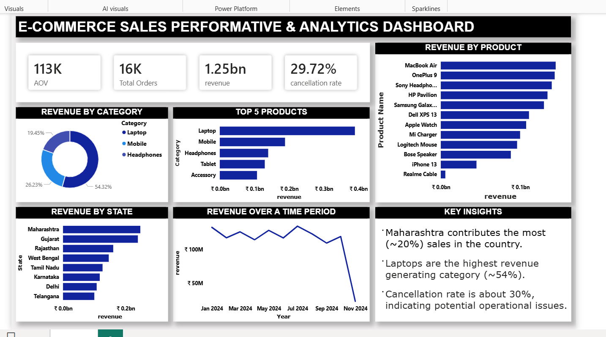

# E-Commerce Sales Performance & Customer Analytics

An interactive Power BI dashboard built to analyze e-commerce sales performance across products, categories, locations, and time periods.

The project focuses on turning transactional data into clear business insights through KPI tracking, sales analysis, and interactive visualizations.

## Dashboard Overview

The dashboard provides an interactive view of overall sales performance and allows users to explore the data using dynamic filters and slicers.



## Key KPIs

The dashboard tracks:

- Total Revenue
- Total Orders
- Average Order Value (AOV)
- Cancellation Rate

## Analysis Covered

### Sales Performance
- Revenue trends over time
- Category-wise sales performance
- State-wise sales performance
- Top 10 products by performance

### Customer & Product Analysis
- Product-level performance
- Category contribution to revenue
- Geographic distribution of sales

### Interactive Analysis
Interactive slicers allow users to dynamically filter the dashboard and explore different segments of the data.

## Key Insights

### 1. Product Performance
Laptops contribute approximately **32% of total revenue**, making them a major contributor to overall sales.

### 2. Geographic Performance
**Maharashtra** was identified as the highest-grossing state in the dataset.

### 3. Revenue Trend
Revenue declined by approximately **18% in Q4**, highlighting a potential seasonal trend that may require further investigation and targeted marketing strategies.

## Data

The analysis uses three CSV datasets:

- `Customers.csv` — Customer information
- `Orders.csv` — Transactional order data
- `Products.csv` — Product information

The datasets are combined and modeled in Power BI to support the dashboard analysis.

## Tools & Technologies

- **Power BI Desktop** — Dashboard development and data visualization
- **DAX** — Measures and analytical calculations
- **CSV** — Source data

## Repository Structure

```text
E-Commerce-Sales-Performance-Analytics/
│
├── Customers.csv
├── Orders.csv
├── Products.csv
├── dashboard_screenshot.png
├── ecom_project.pbix
└── README.md
